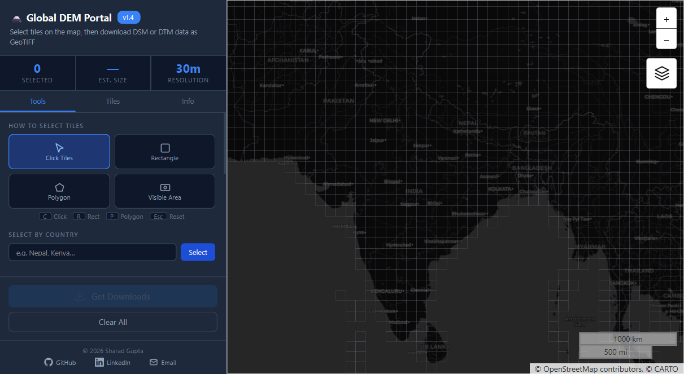
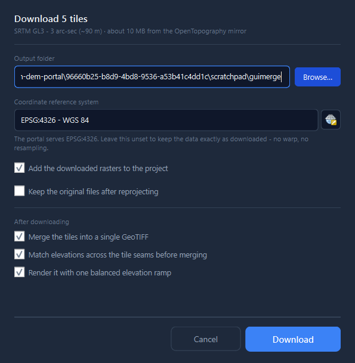
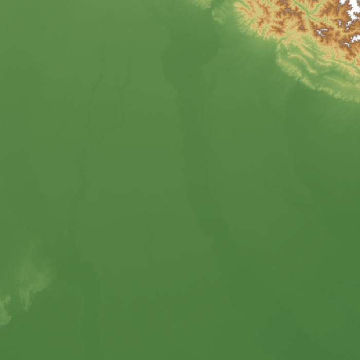

# Global DEM Portal - QGIS plugin

Select 1°×1° tiles on a map and download open global elevation data straight into
QGIS - nine free DEMs, no account, no API key, no server. Then merge the tiles into
one raster, level them to each other at the seams, and render the result with a single
balanced elevation ramp.

This is a **native Qt panel**, not a web view. The [Global DEM Portal](../global_dem_portal)
web app was rebuilt widget for widget: the colours, paddings, type sizes and gaps come
from its stylesheet, the 1° grid and land mask are the same 8,100-byte bitmask the page
embeds, and the tile selection produces byte-identical results (India selects the same
354 tiles in both). Nothing in `../global_dem_portal` is modified or served - there is
no QtWebEngine dependency and no loopback HTTP server.



## Install

Download `dist/global_dem_portal.zip` and use *Plugins → Manage and Install Plugins →
Install from ZIP*, or build and install from source:

```bash
python build.py --install     # build the zip and install into your QGIS profile
python build.py               # just dist/global_dem_portal.zip
python validate.py --new      # run the plugin repository's own checks against the zip
```

Then enable **Global DEM Portal** in *Plugins → Manage and Install Plugins → Installed*.
The plugin appears as a toolbar button and under *Plugins → Global DEM Portal*; the
button is a toggle, so clicking it again hides the panel.

**Requirements:** QGIS 3.22 or newer, Qt5 or Qt6. GDAL and NumPy come with QGIS and are
the only other dependencies. Verified end to end on QGIS 4.0.3 (Qt 6.11, Python 3.12,
Windows).

The panel opens docked across the top of the window, spanning the full width between
the side panels, because it needs the room: the sidebar is 320 px and the map takes the
rest. Dock it wherever you like afterwards - the map keeps a 160 px floor so it can
never be squeezed out of existence.

## Selecting tiles

| Tool                   | Key     | What it does                                                   |
| ---------------------- | ------- | -------------------------------------------------------------- |
| **Click Tiles**  | `C`   | Click a cell to add it, click again to remove it.              |
| **Rectangle**    | `R`   | Drag a box; every drawable cell it touches is selected.        |
| **Polygon**      | `P`   | Click vertices, double-click or right-click to close.          |
| **Visible Area** |         | Every drawable cell in the current view, as a one-shot action. |
| **Clear All**    | `Esc` | Empties the selection and the boundary outline.                |

**Select by Country** looks the name up on Nominatim and selects the tiles its boundary
covers. **Upload GeoJSON Geometry** does the same for a Polygon or MultiPolygon you
drop on it (or click to browse), up to 25 MB.

A cell counts as inside a boundary when any point of a 3×3 sample grid within it falls
inside - testing only the centre drops border cells such as Tawang. The grid is drawn
only over cells that actually have a tile on the mirror, so open ocean stays blank and
cannot be selected, and red dashed lines mark the selected product's latitude limits.

The **Tiles** tab lists the selection as chips; click one to remove it. The **Info** tab
documents the datasets, the tile naming convention and the coverage limits.

## Datasets

| Product           | Type | Resolution | Coverage        |
| ----------------- | ---- | ---------- | --------------- |
| SRTM GL1          | DSM  | ~30 m      | 56°S - 60°N   |
| NASADEM           | DSM  | ~30 m      | 56°S - 60°N   |
| ALOS AW3D30       | DSM  | ~30 m      | 82°S - 82°N   |
| Copernicus GLO-30 | DSM  | ~30 m      | global          |
| Mapzen (Tilezen)  | DSM  | ~30 m      | 56°S - 60°N\* |
| ANADEM (ML)       | DTM  | ~30 m      | South America   |
| GEDTM30 (ML)      | DTM  | ~30 m      | global          |
| SRTM GL3          | DSM  | ~90 m      | 56°S - 60°N   |
| Copernicus GLO-90 | DSM  | ~90 m      | global          |

\* Mapzen's own data is global, but this portal caps it to the SRTM band so it only
offers cells already on the land-mask grid.

**Type** (DSM: surface, includes canopy and buildings; DTM: bare earth) and
**Resolution** together decide which sources are offered - DTM is 1 arc-second only.
Switching product drops any selected cell it cannot serve, and says how many.

ANADEM and GEDTM30 are not tiled at all: they are single Cloud-Optimized GeoTIFFs of
66 GB and 403 GB. For those, only the selected window is read, over HTTP range
requests through GDAL's `/vsicurl/` - the whole file is never fetched.

## Downloading



Tiled products are fetched one file per cell, four at a time, straight from the
OpenTopography mirror. The progress bar sits under the button, which becomes **Cancel**
while a job runs. HTTP goes through `QgsBlockingNetworkRequest`, so proxy hosts, proxy
credentials, authentication configs and timeouts configured in QGIS all apply.

The dialog asks the two questions a browser could not:

- **Output folder** - where the files land. Downloads are never overwritten, except for
  Mapzen's `.hgt`, whose georeferencing lives in its *filename*: GDAL's SRTMHGT driver
  reads `N28E077.hgt`'s corner out of the name and from nowhere else, so a second copy
  named `N28E077 (2).hgt` would be an unopenable file rather than a duplicate.
- **Coordinate reference system** - leave it unset to keep the data exactly as
  published (EPSG:4326, no warp, no resampling). Set one and the download is warped
  into it with bilinear resampling, once, after merging.

### Merging and colour balancing

A folder of DEM tiles is awkward: QGIS stretches each one over its own min/max, so
neighbours come out at visibly different brightnesses, and SRTM's void value (−32768)
drags any stretch that includes it down into the seabed. Three options address that,
because a DEM mosaic can be uneven in three different ways.

**Merge the tiles into a single GeoTIFF** builds a tiled, DEFLATE-compressed, overviewed
mosaic (`PREDICTOR` chosen for the band's data type) with the fill value declared as
nodata - which is by itself the single biggest improvement to how a mosaic looks.
Merging happens *before* reprojection, so a target CRS warps one mosaic instead of
thirty tiles, and the resampling kernel never has to stop at a tile edge. The
downloaded tiles are always kept.

**Match elevations across the tile seams** measures the median difference along every
shared edge, then solves for the per-tile shift that best closes all of them at once,
with the mean offset pinned at zero so the mosaic is levelled without being moved off
its datum. Tiles from one mission normally agree exactly, and the message bar says so
rather than rewriting anything.

**Render it with one balanced elevation ramp** clips to the 0.1st-99.9th percentile
with voids excluded, and gives *every* layer the same range - so a plateau tile and a
mountain tile are shaded on one scale instead of each on its own. The ramp is
hypsometric: green lowland through tan and brown to grey and white, with water below
sea level where the data contains it.



If the selected tiles are spread out, the plugin asks before merging. A mosaic is a
rectangle, so it always spans the bounding box of what you chose, and every unselected
cell inside that box still has to exist as nodata. The confirmation gives the numbers -
pixel dimensions, gigapixels, and how much would be padding - and offers **Merge
anyway**, **Download without merging** or **Cancel**.

## Development

```text
plugin.py      the QGIS entry point: toolbar action, menu, the dock
panel.py       the sidebar and its behaviour - the bulk of the plugin
mapview.py     the map canvas, 1° grid overlay, land mask, boundary corrections
theme.py       the design, transcribed from the web app's CSS; UI_SCALE lives here
widgets.py     one class per CSS class - SectionTitle, ToolCard, ResOption, …
icons.py       the page's inline SVG paths, rendered to QIcon
maptools.py    click / rectangle / polygon selection tools
geometry.py    GeoJSON parsing, boundary-to-tiles, the 3×3 sample rule
products.py    the nine products and their URL and filename builders
dialog.py      the download dialog: folder, CRS, merge and colour options
downloader.py  QgsTask: fetch, merge, balance, reproject
mosaic.py      merging, seam measurement and levelling, stretch and colour
layers.py      loading rasters into the project, CRS comparison, warping
net.py         HTTPS through QGIS's own network stack
paths.py       settings
build.py       build the zip / install into a profile   (not shipped)
validate.py    the plugin repository's checks, offline  (not shipped)
```

`validate.py` is a transcription of `qgis-app/plugins/validator.py` from the
[QGIS-Django](https://github.com/qgis/QGIS-Django) codebase - the same constants,
regular expressions and message wording the upload page uses - plus the form-level
rules from `forms.py` and `models.py`, and a few checks of its own (no scanner
suppressions, no credential-shaped literals, no build-machine paths). Run it before
publishing:

```bash
python validate.py --new        # --new applies the stricter first-upload rules
python validate.py --offline    # skip the URL reachability checks
```

Two conventions worth knowing before editing:

- **`theme.UI_SCALE`** multiplies every type size, icon, padding and box height. The
  QSS below it is a faithful transcription of `index.html`, so the numbers you read
  there are the web app's numbers; the scale is applied in one pass over the finished
  sheet. Set it to `1.0` to get the page's own metrics back.
- **Qt stylesheets cascade into dialogs.** A stylesheet applies to its owner and to
  everything below it in the object hierarchy, and a dialog is a child of the widget it
  is opened from. The download dialog is therefore parented to the QGIS main window,
  and its own rules are scoped with `#downloadDialog > …`, so nothing the panel styles
  can reach a dialog QGIS draws. Getting this wrong makes QGIS's CRS selector
  unreadable.

## Attribution

* **SRTM** - NASA JPL (2013), *SRTM Global 1 arc second*,
  [doi:10.5067/MEaSUREs/SRTM/SRTMGL1.003](https://doi.org/10.5067/MEaSUREs/SRTM/SRTMGL1.003)
* **NASADEM** - NASA JPL (2020), NASADEM_HGT v001
* **ALOS AW3D30** - © JAXA, ALOS World 3D-30m
* **Copernicus GLO-30 / GLO-90** - © ESA / Airbus, produced from TanDEM-X
* **Mapzen (Tilezen) terrain tiles** - © Mapzen, built from SRTM/GMTED/ETOPO1 and other
  sources; redistributed as a static snapshot via the
  [AWS Open Data Program](https://registry.opendata.aws/terrain-tiles/)
* **ANADEM** - [doi:10.5069/G9736P4G](https://doi.org/10.5069/G9736P4G), a machine-learning
  bare-earth model for South America
* **GEDTM30** - [doi:10.5069/G9BV7DT1](https://doi.org/10.5069/G9BV7DT1), a global ensemble
  machine-learning terrain model

SRTM/NASADEM/ALOS/Copernicus/ANADEM/GEDTM30 redistributed by OpenTopography; Mapzen via
AWS Open Data (a separate mirror). Basemaps © OpenStreetMap contributors, © CARTO.
India boundary © [DataMeet Community Maps](https://github.com/datameet/maps); basemap
boundary correction via [india_boundary_corrector](https://github.com/ramSeraph/india_boundary_corrector)
(© ramSeraph, Unlicense; data OSM ODbL / Natural Earth). ANADEM/GEDTM30 clipping uses
[geotiff.js](https://github.com/geotiffjs/geotiff.js) (© geotiffjs contributors, MIT).

---

© 2026 Sharad Gupta. Application code released under the MIT License; the elevation data
and map layers remain under the licenses of their respective providers listed above.
